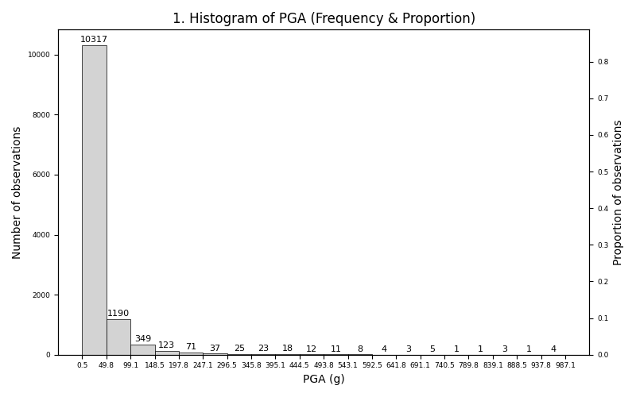
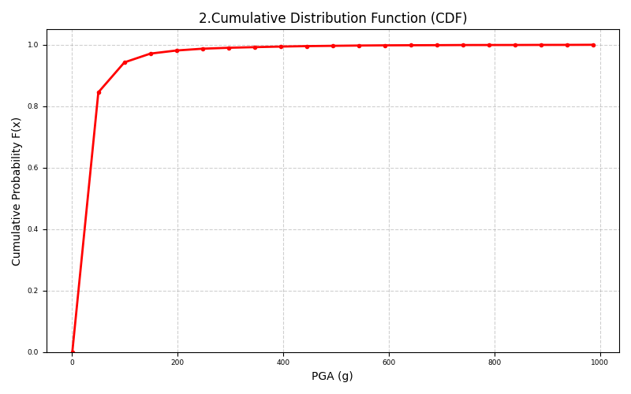

# PGA Histogram & CDF Analysis

Statistical analysis and visualization of Peak Ground Acceleration (PGA) data using manually implemented formulas — no reliance on NumPy statistical functions.

## Problem Statement
Write a python code that for the PGA file provided, make plot histogram and CDF of PGA.
Which PGA values have the more frequency? Calculate mean, range, standard deviation and skewness of PGA values as well and make
discussion about these values.

## Project Files

| File | Description |
|------|-------------|
| `pgaAnalysis.py` | Main script for computation and plotting |
| `pga.txt` | Input file containing PGA values (one per line) |
| `question.txt` | text version of the assignment |
| `requirements.txt` | Python dependencies |
| `cdf.png` | output CDF plot generated |
| `histogram.png` | output Histogram plot generated |

## Method Summary

1. This project reads PGA values from a text file.
2. computes all statistical measures from scratch using direct mathematical formulas.
3. The goal is to demonstrate a clear, formula-first implementation rather than calling library abstractions. So all statistics are implemented manually:

- **Mean**: $\bar{x} = \frac{1}{n}\sum_{i=1}^{n} x_i$
- **Range**: $R = x_{\max} - x_{\min}$
- **Sample standard deviation**: $s = \sqrt{\frac{\sum(x_i - \bar{x})^2}{n-1}}$
- **Skewness**: $\gamma = \frac{\frac{1}{n}\sum(x_i - \bar{x})^3}{s^3}$
- **Relative frequency** and **CDF**: built from manually defined bins

NumPy is used only to load data from `pga.txt`.

## Requirements

```
pip install -r requirements.txt
```

## How to Run

```
python pgaAnalysis.py
```

## Output

**Terminal output:**
- Number of PGA values ($n$)
- Mean, standard deviation, range, skewness
- Interval with highest frequency

**Plots generated:**
- Histogram of PGA frequencies and proportions
- Cumulative Distribution Function (CDF)

## Sample Outputs

### Histogram


### CDF


## Notes

- This project was developed as part of an academic exercise related to uncertainty modeling, fuzzy variables, and probabilistic simulation in engineering applications.
